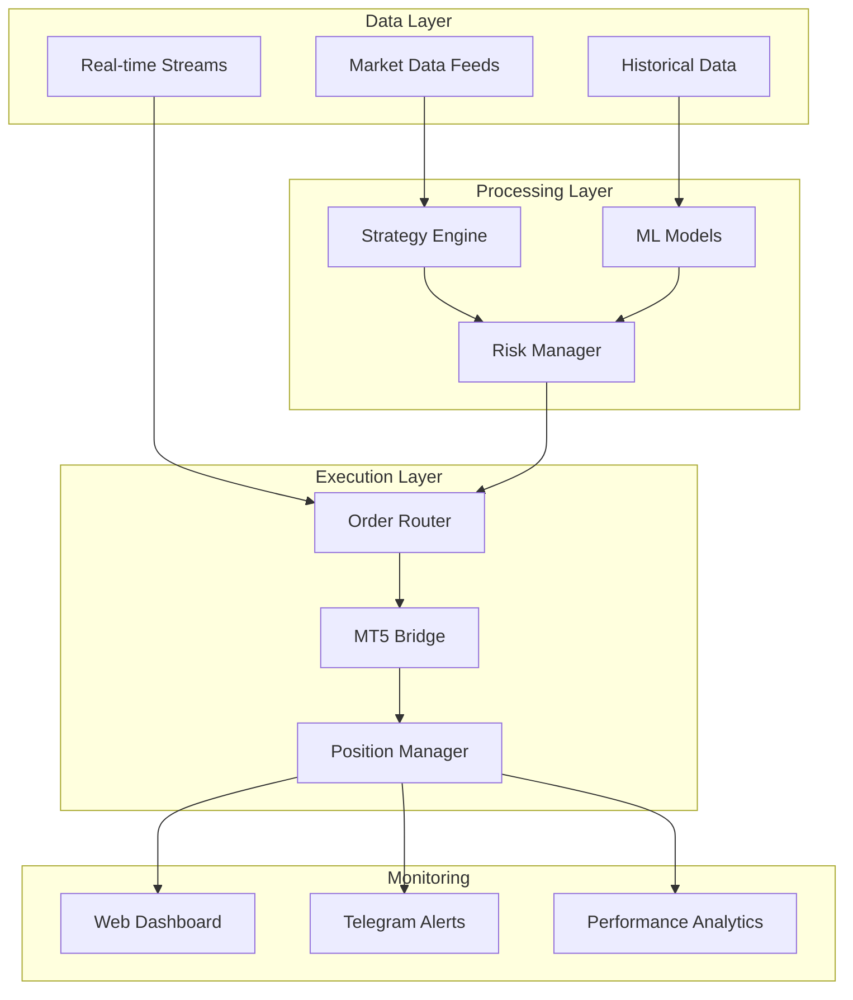

# [🚀 Market Master Algorithmic Trading System](https://github.com/Sauvageduck24/Market-Master-Algorithmic-Trading-System)

  
  
   
  
  
  
  
  
  
  
  
  <h2>🎯 Enterprise-Grade Algorithmic Trading Platform</h2>
  
<strong>Professional quantitative trading system with advanced ML capabilities, real-time execution, and comprehensive risk management</strong>

---

## 🌟 Executive Summary

**Market Master** is a sophisticated algorithmic trading platform that combines cutting-edge machine learning, advanced technical analysis, and institutional-grade execution capabilities. Built for professional traders, quantitative analysts, and financial institutions seeking robust, scalable trading solutions.

### 🎯 Key Value Propositions

- **📊 80+ Advanced Trading Strategies** - Comprehensive library of technical, statistical, and ML-based strategies
- **🤖 Machine Learning Integration** - CatBoost, Optuna optimization, and anomaly detection
- **⚡ Real-Time Execution** - Direct MT5 integration with sub-second latency
- **🛡️ Enterprise Risk Management** - Multi-layer risk controls and position sizing
- **📈 Professional Backtesting** - Walk-forward analysis and Monte Carlo simulations
- **🌐 Web Dashboard** - Real-time monitoring and control interface

---

## 🏗️ Technical Architecture

### Core Components

| Component | Technology Stack | Purpose |
|-----------|------------------|---------|
| **Strategy Engine** | Python, NumPy, Pandas | 80+ trading strategies execution |
| **ML Pipeline** | CatBoost, Scikit-learn, Optuna | Model training and optimization |
| **Execution Engine** | MetaTrader5 API | Real-time order execution |
| **Web Interface** | Flask, Bootstrap | Monitoring and control dashboard |
| **Data Pipeline** | Polars, VectorBT | High-performance data processing |
| **Risk Management** | Custom algorithms | Position sizing and risk controls |

### System Architecture

---

## 🎯 Professional Features

### 📊 Advanced Strategy Library
- **Technical Analysis**: RSI, MACD, Bollinger Bands, Ichimoku, Elliott Wave
- **Statistical Models**: ARIMA, GARCH, Mean Reversion, Statistical Arbitrage
- **Machine Learning**: CatBoost classifiers, anomaly detection, regime detection
- **Pattern Recognition**: Harmonic patterns, candlestick formations, support/resistance
- **Microstructure**: Order flow analysis, liquidity detection, market impact

### 🤖 Machine Learning Capabilities
- **Automated Feature Engineering**: 100+ technical indicators
- **Hyperparameter Optimization**: Optuna with Bayesian optimization
- **Model Validation**: Walk-forward analysis and cross-validation
- **Anomaly Detection**: Isolation Forest and One-Class SVM
- **Ensemble Methods**: Strategy combination and signal fusion

### ⚡ Real-Time Execution
- **Sub-second Latency**: Optimized execution engine
- **Smart Order Routing**: Intelligent order placement
- **Risk Controls**: Real-time position monitoring
- **Slippage Management**: Advanced order timing algorithms
- **Multi-timeframe Support**: 1m to 1D timeframes

### 🛡️ Risk Management
- **Position Sizing**: Kelly Criterion and volatility-based sizing
- **Drawdown Protection**: Dynamic stop-loss and take-profit
- **Correlation Analysis**: Portfolio diversification controls
- **VaR Calculation**: Value at Risk monitoring
- **Stress Testing**: Monte Carlo simulations

---

## 📈 System Performance

### Key Performance Indicators
- **Low Latency Execution**: Optimized for real-time trading
- **High Throughput Processing**: Efficient data handling capabilities
- **Scalable Architecture**: Designed for institutional workloads
- **Robust Monitoring**: Comprehensive system health tracking
- **Resource Optimization**: Efficient memory and CPU utilization

--- 

## 🎯 Use Cases

### For Quantitative Analysts
- **Strategy Development**: Rapid prototyping and testing
- **Research Platform**: Advanced analytics and visualization
- **Model Validation**: Walk-forward and Monte Carlo testing
- **Performance Analysis**: Comprehensive metrics and reporting

### For Professional Traders
- **Automated Trading**: 24/7 strategy execution
- **Risk Management**: Real-time position monitoring
- **Portfolio Management**: Multi-strategy allocation
- **Performance Tracking**: Detailed analytics and reporting

### For Financial Institutions
- **Institutional Platform**: Scalable architecture
- **Compliance**: Audit trails and risk controls
- **Integration**: API-first design for custom integrations
- **Customization**: Modular architecture for specific needs

---

## 📊 Monitoring & Analytics

### Real-Time Dashboard
- **Portfolio Overview**: Current positions and P&L
- **Strategy Performance**: Individual strategy metrics
- **Risk Metrics**: VaR, drawdown, and exposure
- **System Health**: Latency, errors, and uptime

### Performance Analytics
- **Backtesting Reports**: Comprehensive strategy analysis
- **Walk-Forward Results**: Out-of-sample validation
- **Monte Carlo Simulations**: Risk assessment
- **Strategy Correlation**: Portfolio diversification analysis

---

## 🧪 Testing & Quality Assurance

### Test Coverage
- **Unit Tests**: Comprehensive code coverage
- **Integration Tests**: Strategy and execution testing
- **Performance Tests**: Latency and throughput validation
- **Risk Tests**: Stress testing and scenario analysis

### Code Quality
- **PEP 8 Compliance**: Automated code formatting
- **Type Hints**: Full type annotation coverage
- **Documentation**: Comprehensive docstrings
- **Static Analysis**: Linting and security scanning

---

## 📚 Documentation & Support

### Technical Documentation
- **API Reference**: Complete function documentation
- **Architecture Guide**: System design and components
- **Strategy Guide**: Strategy development and optimization
- **Deployment Guide**: Production setup and configuration

### Community & Support
- **GitHub Issues**: Bug reports and feature requests
- **Discussions**: Community support and knowledge sharing
- **Wiki**: Detailed guides and tutorials
- **Examples**: Sample strategies and use cases

---

## 🔒 Security & Compliance

### Security Features
- **API Authentication**: Secure credential management
- **Data Encryption**: End-to-end encryption
- **Audit Logging**: Complete transaction history
- **Access Control**: Role-based permissions

### Compliance
- **Regulatory Compliance**: GDPR and financial regulations
- **Data Retention**: Configurable data retention policies
- **Reporting**: Automated compliance reporting
- **Audit Trails**: Complete system audit trails

---

## ⚠️ Risk Disclaimer

**IMPORTANT**: This software is for educational and research purposes. Trading involves substantial risk of loss and is not suitable for all investors. Past performance does not guarantee future results. Always test thoroughly in a demo environment before live trading.

### Risk Warnings
- Algorithmic trading can result in significant financial losses
- Market conditions can change rapidly, affecting strategy performance
- Technical failures can result in missed opportunities or losses
- Always use proper risk management and position sizing

---

  <h3>🎉 Ready to Transform Your Trading?</h3>
  
<strong>Join the future of algorithmic trading with Market Master</strong>

  
  
  
  
  
  
<em>Built with ❤️ for the quantitative trading community</em>

